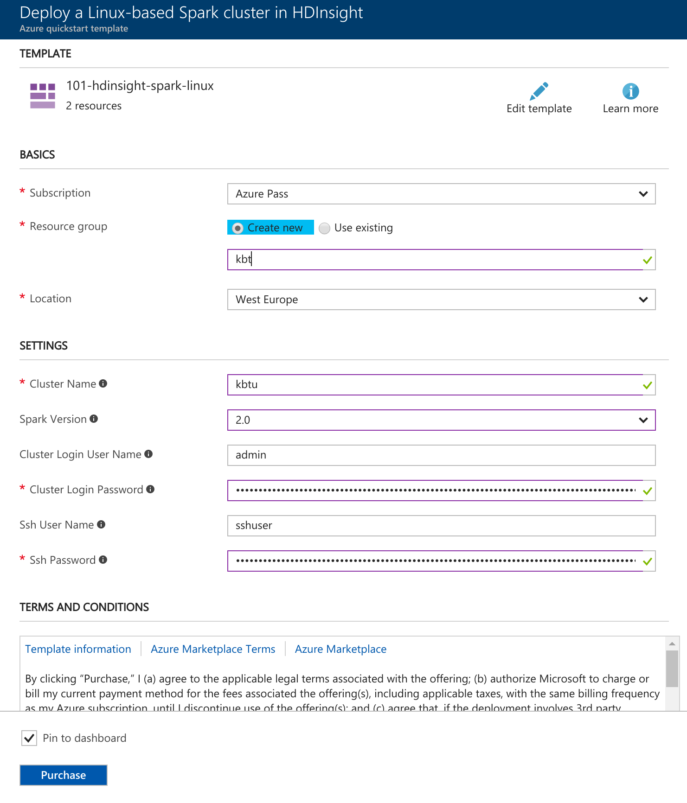
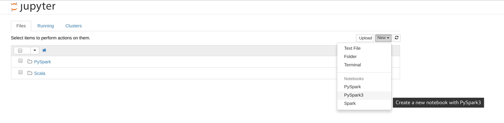

# Getting started with Apache Spark in Azure

Learn how to create an [Apache Spark](hdinsight-apache-spark-overview.md) cluster in HDInsight and run interactive Spark SQL queries using [Jupyter](https://jupyter.org) notebook.

## Prerequisites

* **An Azure subscription**. Before you begin this tutorial, you must have an Azure subscription. See [Create your free Azure account today](https://azure.microsoft.com/free).

## What is Apache Spark on Azure HDInsight?
Spark clusters on HDInsight offer a fully managed Spark service. Benefits of creating a Spark cluster on HDInsight are listed here.

| Feature | Description |
| --- | --- |
| Ease of creating Spark clusters |You can create a new Spark cluster on HDInsight in minutes using the Azure Portal, Azure PowerShell, or the HDInsight .NET SDK. |
| Ease of use |Spark cluster in HDInsight include Jupyter and Zeppelin notebooks. You can use these for interactive data processing and visualization.|
| REST APIs |Spark clusters in HDInsight include [Livy](https://github.com/cloudera/hue/tree/master/apps/spark/java#welcome-to-livy-the-rest-spark-server), a REST API-based Spark job server to remotely submit and monitor jobs. |
| Support for Azure Data Lake Store | Spark cluster on HDInsight can be configured to use Azure Data Lake Store as an additional storage, as well as primary storage (only with HDInsight 3.5 clusters). |
| Integration with Azure services |Spark cluster on HDInsight comes with a connector to Azure Event Hubs. Customers can build streaming applications using the Event Hubs, in addition to [Kafka](http://kafka.apache.org/), which is already available as part of Spark. |
| Support for R Server | You can set up a R Server on HDInsight Spark cluster to run distributed R computations with the speeds promised with a Spark cluster. |
| Integration with third-party IDEs | HDInsight provides plugins for IDEs like IntelliJ IDEA and Eclipse that you can use to create and submit applications to an HDInsight Spark cluster.|
| Concurrent Queries |Spark clusters in HDInsight support concurrent queries. This enables multiple queries from one user or multiple queries from various users and applications to share the same cluster resources. |
| Caching on SSDs |You can choose to cache data either in memory or in SSDs attached to the cluster nodes. Caching in memory provides the best query performance but could be expensive; caching in SSDs provides a great option for improving query performance without the need to create a cluster of a size that is required to fit the entire dataset in memory. |
| Integration with BI Tools |Spark clusters on HDInsight provide connectors for  BI tools such as [Power BI](http://www.powerbi.com/) and [Tableau](http://www.tableau.com/products/desktop) for data analytics. |
| Pre-loaded Anaconda libraries |Spark clusters on HDInsight come with Anaconda libraries pre-installed. [Anaconda](http://docs.continuum.io/anaconda/) provides close to 200 libraries for machine learning, data analysis, visualization, etc. |
| Scalability |Although you can specify the number of nodes in your cluster during creation, you may want to grow or shrink the cluster to match workload. All HDInsight clusters allow you to change the number of nodes in the cluster. Also, Spark clusters can be dropped with no loss of data since all the data is stored in Azure Storage or Data Lake Store. |

### Kernels for Jupyter notebook on Spark clusters in Azure HDInsight

HDInsight Spark clusters provide kernels that you can use with the Jupyter notebook on Spark for testing your applications. A kernel is a program that runs and interprets your code. The three kernels are:

- **PySpark** - for applications written in Python2
- **PySpark3** - for applications written in Python3
- **Spark** - for applications written in Scala

### Benefits of using the kernels

Here are a few benefits of using the new kernels with Jupyter notebook on Spark HDInsight clusters.

- **Preset contexts**. With  **PySpark**, **PySpark3**, or the **Spark** kernels, you do not need to set the Spark or Hive contexts explicitly before you start working with your applications. These are available by default. These contexts are:

   * **sc** - for Spark context
   * **sqlContext** - for Hive context

    So, you don't have to run statements like the following to set the contexts:

      	sc = SparkContext('yarn-client')
      	sqlContext = HiveContext(sc)

    Instead, you can directly use the preset contexts in your application.

- **Cell magics**. The PySpark kernel provides some predefined “magics”, which are special commands that you can call with `%%` (for example, `%%MAGIC` <args>). The magic command must be the first word in a code cell and allow for multiple lines of content. The magic word should be the first word in the cell. Adding anything before the magic, even comments, causes an error.     For more information on magics, see [here](http://ipython.readthedocs.org/en/stable/interactive/magics.html).

The following table lists the different magics available through the kernels.

   | Magic | Example | Description |
   | --- | --- | --- |
   | help |`%%help` |Generates a table of all the available magics with example and description |
   | info |`%%info` |Outputs session information for the current Livy endpoint |
   | configure |`%%configure -f` `{"executorMemory": "1000M"`, `"executorCores": 4`} |Configures the parameters for creating a session. The force flag (-f) is mandatory if a session has already been created, which ensures that the session is dropped and recreated. Look at [Livy's POST /sessions Request Body](https://github.com/cloudera/livy#request-body) for a list of valid parameters. Parameters must be passed in as a JSON string and must be on the next line after the magic, as shown in the example column. |
   | sql |`%%sql -o <variable name>`  `SHOW TABLES` |Executes a Hive query against the sqlContext. If the `-o` parameter is passed, the result of the query is persisted in the %%local Python context as a [Pandas](http://pandas.pydata.org/) dataframe. |
   | local |`%%local` `a=1` |All the code in subsequent lines is executed locally. Code must be valid Python2 code even irrespective of the kernel you are using. So, even if you selected **PySpark3** or **Spark** kernels while creating the notebook, if you use the `%%local` magic in a cell, that cell must only have valid Python2 code.. |
   | logs |`%%logs` |Outputs the logs for the current Livy session. |
   | delete |`%%delete -f -s <session number>` |Deletes a specific session of the current Livy endpoint. Note that you cannot delete the session that is initiated for the kernel itself. |
   | cleanup |`%%cleanup -f` |Deletes all the sessions for the current Livy endpoint, including this notebook's session. The force flag -f is mandatory. |

> **Info** In addition to the magics added by the PySpark kernel, you can also use the [built-in IPython magics](https://ipython.org/ipython-doc/3/interactive/magics.html#cell-magics), including `%%sh`. You can use the `%%sh` magic to run scripts and block of code on the cluster headnode.

*. **Auto visualization**. The **Pyspark** kernel automatically visualizes the output of Hive and SQL queries. You can choose between several different types of visualizations including Table, Pie, Line, Area, Bar.

## Create HDInsight Spark cluster

In this section, you create an HDInsight Spark cluster using an [Azure Resource Manager template](https://azure.microsoft.com/resources/templates/101-hdinsight-spark-linux/). For other cluster creation methods, see [Create HDInsight clusters](hdinsight-hadoop-provision-linux-clusters.md).

1. Click the following image to open the template in the Azure portal.

    

2. Enter the following values:

    

	* **Subscription**: Select your Azure subscription for this cluster.
	* **Resource group**: Create a resource group or select an existing one. Resource group is used to manage Azure resources for your projects.
	* **Location**: Select a location for the resource group.  This location is also used for the default cluster storage and the HDInsight cluster.
	* **ClusterName**: Enter a name for the Hadoop cluster that you create.
	* **Spark version**: Select the Spark version that you want to install on the cluster (v2.0)
	* **Cluster login name and password**: The default login name is admin.
	* **SSH user name and password**.

   Write down these values.  You need them later in the tutorial.

3. Select **I agree to the terms and conditions stated above**, select **Pin to dashboard**, and then click **Purchase**. You can see a new tile titled Submitting deployment for Template deployment. It takes about 20 minutes to create the cluster.

> **Info** This article creates a Spark cluster that uses Azure Storage Blobs as the cluster storage. You can also create a Spark cluster that uses Azure Data Lake Store as additional storage, in addition to Azure Storage Blobs as the default storage.

## Run an interactive Spark SQL query

In this section, you use Jupyter notebook to run interactive Spark SQL queries against the Spark cluster you created earlier. HDInsight Spark clusters provide three kernels that you can use with the Jupyter notebook. These are:

* **PySpark** (for applications written in Python)
* **PySpark3** (for applications written in Python3)
* **Spark** (for applications written in Scala)

In this course, you'll use the **PySpark3** kernel in the notebook from where you run the interactive Spark SQL query. Some of the key benefits of using the PySpark kernel are:

* The contexts for Spark and Hive are set automatically.
* Use cell magics, such as `%%sql`, to directly run interactive SQL or Hive queries, without any preceding code snippets.
* The output from the interactive queries is automatically visualized.

### Create Jupyter notebook with PySpark kernel

1. Open the [Azure portal](https://portal.azure.com/).

2. If you opted to pin the cluster to the dashboard, click the cluster tile from the dashboard to launch the cluster blade.

	If you did not pin the cluster to the dashboard, from the left pane, click **HDInsight clusters**, and then click the cluster you created.

3. From **Quick links**, click **Cluster dashboards**, and then click **Jupyter Notebook**. If prompted, enter the admin credentials for the cluster.

   

   >** Info ** You may also access the Jupyter notebook for your cluster by opening the following URL in your browser. Replace **CLUSTERNAME** with the name of your cluster:
   `https://CLUSTERNAME.azurehdinsight.net/jupyter`

3. Create a notebook. Click **New**, and then click **PySpark3**.

   

   A new notebook is created and opened with the name Untitled(Untitled.pynb).

4. Click the notebook name at the top, and enter a friendly name if you want.

    

5. Paste the following code in an empty cell, and then press **SHIFT + ENTER** to run the code. The code imports the types required for this scenario:

		from pyspark.sql.types import *

    Because you created a notebook using the PySpark kernel, you do not need to create any contexts explicitly. The Spark and Hive contexts are automatically created for you when you run the first code cell.

    

    Every time you run an interactive query in Jupyter, your web browser window title shows a **(Busy)** status along with the notebook title. You also see a solid circle next to the **PySpark** text in the top-right corner. After the job is completed, it changes to a hollow circle.

# Delete an HDInsight cluster

HDInsight cluster billing starts once a cluster is created and stops when the cluster is deleted. Billing is pro-rated per minute, so you should always delete your cluster when it is no longer in use. In this document, you learn how to delete a cluster using the Azure portal, Azure PowerShell, and the Azure CLI 1.0.

>** Warning **
Deleting an HDInsight cluster does not delete the Azure Storage accounts associated with the cluster. This allows you to reuse your data in the future.

## Azure portal

1. Log in to the [Azure portal](https://portal.azure.com) and select your HDInsight cluster. If your HDInsight cluster is not pinned to the dashboard, you can search for it by name using the search field.

    

2. Once the blade opens for the cluster, select the **Delete** icon. When prompted, select **Yes** to delete the cluster.

    

## Azure CLI

From a prompt, use the following to delete the cluster:

    azure hdinsight cluster delete CLUSTERNAME

Replace `CLUSTERNAME` with the name of your HDInsight cluster.

> This section is from: [Microsoft Azure Docs](https://github.com/MicrosoftDocs/azure-docs)
