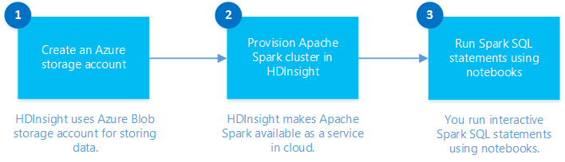
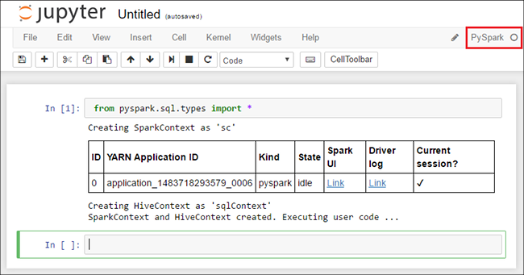
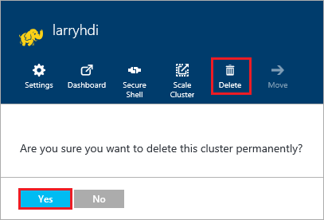

# Getting started with Apache Spark in Azure

Learn how to create an [Apache Spark](hdinsight-apache-spark-overview.md) cluster in HDInsight and run interactive Spark SQL queries using [Jupyter](https://jupyter.org) notebook.

## Prerequisites

* **An Azure subscription**. Before you begin this tutorial, you must have an Azure subscription. See [Create your free Azure account today](https://azure.microsoft.com/free).

## Create HDInsight Spark cluster

In this section, you create an HDInsight Spark cluster using an [Azure Resource Manager template](https://azure.microsoft.com/resources/templates/101-hdinsight-spark-linux/). For other cluster creation methods, see [Create HDInsight clusters](hdinsight-hadoop-provision-linux-clusters.md).

1. Click the following image to open the template in the Azure portal.         

    

2. Enter the following values:

    

	* **Subscription**: Select your Azure subscription for this cluster.
	* **Resource group**: Create a resource group or select an existing one. Resource group is used to manage Azure resources for your projects.
	* **Location**: Select a location for the resource group.  This location is also used for the default cluster storage and the HDInsight cluster.
	* **ClusterName**: Enter a name for the Hadoop cluster that you create.
	* **Spark version**: Select the Spark version that you want to install on the cluster (v2.0)
	* **Cluster login name and password**: The default login name is admin.
	* **SSH user name and password**.

   Write down these values.  You need them later in the tutorial.

3. Select **I agree to the terms and conditions stated above**, select **Pin to dashboard**, and then click **Purchase**. You can see a new tile titled Submitting deployment for Template deployment. It takes about 20 minutes to create the cluster.

> **Info** This article creates a Spark cluster that uses Azure Storage Blobs as the cluster storage. You can also create a Spark cluster that uses Azure Data Lake Store as additional storage, in addition to Azure Storage Blobs as the default storage.

## Run an interactive Spark SQL query

In this section, you use Jupyter notebook to run interactive Spark SQL queries against the Spark cluster you created earlier. HDInsight Spark clusters provide three kernels that you can use with the Jupyter notebook. These are:

* **PySpark** (for applications written in Python)
* **PySpark3** (for applications written in Python3)
* **Spark** (for applications written in Scala)

In this course, you'll use the **PySpark3** kernel in the notebook from where you run the interactive Spark SQL query. Some of the key benefits of using the PySpark kernel are:

* The contexts for Spark and Hive are set automatically.
* Use cell magics, such as `%%sql`, to directly run interactive SQL or Hive queries, without any preceding code snippets.
* The output from the interactive queries is automatically visualized.

### Create Jupyter notebook with PySpark kernel

1. Open the [Azure portal](https://portal.azure.com/).

2. If you opted to pin the cluster to the dashboard, click the cluster tile from the dashboard to launch the cluster blade.

	If you did not pin the cluster to the dashboard, from the left pane, click **HDInsight clusters**, and then click the cluster you created.

3. From **Quick links**, click **Cluster dashboards**, and then click **Jupyter Notebook**. If prompted, enter the admin credentials for the cluster.

   

   >** Info ** You may also access the Jupyter notebook for your cluster by opening the following URL in your browser. Replace **CLUSTERNAME** with the name of your cluster:
   `https://CLUSTERNAME.azurehdinsight.net/jupyter`

3. Create a notebook. Click **New**, and then click **PySpark**.

   

   A new notebook is created and opened with the name Untitled(Untitled.pynb).

4. Click the notebook name at the top, and enter a friendly name if you want.

    

5. Paste the following code in an empty cell, and then press **SHIFT + ENTER** to run the code. The code imports the types required for this scenario:

		`from pyspark.sql.types import *`

    Because you created a notebook using the PySpark kernel, you do not need to create any contexts explicitly. The Spark and Hive contexts are automatically created for you when you run the first code cell.

    

    Every time you run an interactive query in Jupyter, your web browser window title shows a **(Busy)** status along with the notebook title. You also see a solid circle next to the **PySpark** text in the top-right corner. After the job is completed, it changes to a hollow circle.

# Delete an HDInsight cluster

HDInsight cluster billing starts once a cluster is created and stops when the cluster is deleted. Billing is pro-rated per minute, so you should always delete your cluster when it is no longer in use. In this document, you learn how to delete a cluster using the Azure portal, Azure PowerShell, and the Azure CLI 1.0.

>** Warning **
Deleting an HDInsight cluster does not delete the Azure Storage accounts associated with the cluster. This allows you to reuse your data in the future.

## Azure portal

1. Log in to the [Azure portal](https://portal.azure.com) and select your HDInsight cluster. If your HDInsight cluster is not pinned to the dashboard, you can search for it by name using the search field.

    

2. Once the blade opens for the cluster, select the **Delete** icon. When prompted, select **Yes** to delete the cluster.

    

## Azure CLI

From a prompt, use the following to delete the cluster:

    azure hdinsight cluster delete CLUSTERNAME

Replace `CLUSTERNAME` with the name of your HDInsight cluster.

> This section is from: [Microsoft Azure Docs](https://github.com/MicrosoftDocs/azure-docs)
