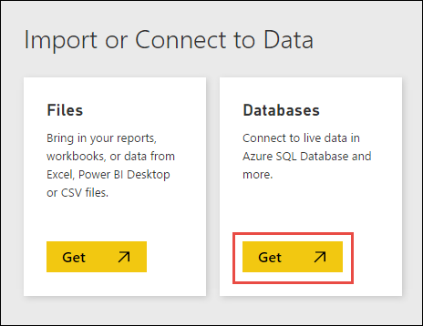
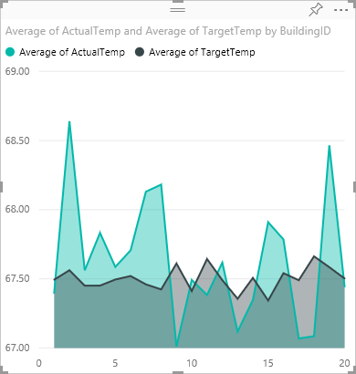

# Spark data visualisation

In this section, we will use the Power BI tool to visualise Apache Spark.

> [BI Jupyter notebook](bi.ipynb)

* Create a new PySpark3 notebook attached to the Spark cluster.

* Because you created a notebook using the PySpark3 kernel, you do not need to create any contexts explicitly. The Spark and Hive contexts are automatically created for you when you run the first code cell. You can start by importing the types required for this scenario. To do so, place the cursor in the cell and press **SHIFT + ENTER**.

```Python
from pyspark.sql import *
```

*. Load sample data into a temporary table. When you create a Spark cluster in HDInsight, the sample data file, **hvac.csv**, is copied to the associated storage account under **\HdiSamples\HdiSamples\SensorSampleData\hvac**.
In an empty cell, paste the following snippet and press **SHIFT + ENTER**. This snippet registers the data into a table called **hvac**.

```Python
# Create an RDD from sample data
hvacText = sc.textFile("wasbs:///HdiSamples/HdiSamples/SensorSampleData/hvac/HVAC.csv")

# Create a schema for our data
Entry = Row('Date', 'Time', 'TargetTemp', 'ActualTemp', 'BuildingID')

# Parse the data and create a schema
hvacParts = hvacText.map(lambda s: s.split(',')).filter(lambda s: s[0] != 'Date')
hvac = hvacParts.map(lambda p: Entry(str(p[0]), str(p[1]), int(p[2]), int(p[3]), int(p[6])))

# Infer the schema and create a table       
hvacTable = sqlContext.createDataFrame(hvac)
hvacTable.registerTempTable('hvactemptable')
dfw = DataFrameWriter(hvacTable)
dfw.saveAsTable('hvac')
```

* Verify that the table was successfully created. You can use the `%%sql` magic to run Hive queries directly.

        %%sql
        SHOW TABLES

    You see an output like shown below:

        +---------------+-------------+
        |tableName      |isTemporary  |
        +---------------+-------------+
        |hvactemptable  |true		 |
        |hivesampletable|false  	  |
        |hvac           |false  	  |
        +---------------+-------------+

    Only the tables that have false under the **isTemporary** column are hive tables that are stored in the metastore and can be accessed from the BI tools. In this tutorial, we connect to the **hvac** table we created.

*. Verify that the table contains the intended data. In an empty cell in the notebook, copy the following snippet and press **SHIFT + ENTER**.

        %%sql
        SELECT * FROM hvac LIMIT 10

* Shut down the notebook to release the resources. To do so, from the **File** menu on the notebook, click **Close and Halt**.

## <a name="powerbi"></a>Use Power BI for Spark data visualization

> [!NOTE]
> This section is applicable only for Spark 1.6 on HDInsight 3.4 and Spark 2.0 on HDInsight 3.5.
>
>

Once you have saved the data as a table, you can use Power BI to connect to the data and visualize it to create reports, dashboards, etc.

* Make sure you have access to Power BI. You can get a free preview subscription of Power BI from [http://www.powerbi.com/](http://www.powerbi.com/).

* Sign in to [Power BI](http://www.powerbi.com/).

* From the bottom of the left pane, click **Get Data**.

* On the **Get Data** page, under **Import or Connect to Data**, for **Databases**, click **Get**.

    
* On the next screen, click **Spark on Azure HDInsight** and then click **Connect**. When prompted, enter the cluster URL (`mysparkcluster.azurehdinsight.net`) and the credentials to connect to the cluster.

	

    After the connection is established, Power BI starts importing data from the Spark cluster on HDInsight.

* Power BI imports the data and adds a **Spark** dataset under the **Datasets** heading. Click the data set to open a new worksheet to visualize the data. You can also save the worksheet as a report. To save a worksheet, from the **File** menu, click **Save**.

    
* Notice that the **Fields** list on the right lists the **hvac** table you created earlier. Expand the table to see the fields in the table, as you defined in notebook earlier.

      
* Build a visualization to show the variance between target temperature and actual temperature for each building. To visualize yoru data, select **Area Chart** (shown in red box). To define the axis, drag-and-drop the **BuildingID** field under **Axis**, and **ActualTemp**/**TargetTemp** fields under **Value**.

    

* By default the visualization shows the sum for **ActualTemp** and **TargetTemp**. For both the fields, from the drop-down, select **Average** to get an average of actual and target temperatures for both buildings.

    

* Your data visualization should be similar to the one in the screenshot. Move your cursor over the visualization to get tool tips with relevant data.

    

* Click **Save** from the top menu and provide a report name. You can also pin the visual. When you pin a visualization, it is stored on your dashboard so you can track the latest value at a glance.

   You can add as many visualizations as you want for the same dataset and pin them to the dashboard for a snapshot of your data. Also, Spark clusters on HDInsight are connected to Power BI with direct connect. This ensures that Power BI always has the most up-to-date data from your cluster so you do not need to schedule refreshes for the dataset.
