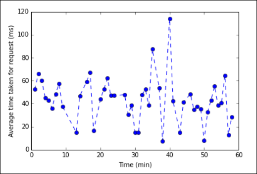

# Data visualisation with Matplotlib

In this section, we will use the Matplotlib to visualise data

> [Jupyter notebook for data visualisation](https://nbviewer.jupyter.org/urls/raw.githubusercontent.com/kks32-courses/data-analytics/master/spark/data-visualisation/viz.ipynb)

* Create a new PySpark3 notebook attached to the Spark cluster.

* A new notebook is created and opened with the name Untitled.pynb. Click the notebook name at the top, and enter a friendly name `viz`.

* Because you created a notebook using the PySpark kernel, you do not need to create any contexts explicitly. The Spark and Hive contexts will be automatically created for you when you run the first code cell. You can start by importing the types that are required for this scenario. Paste the following snippet in an empty cell, and then press **SHIFT + ENTER**.

```Python
from pyspark.sql import Row
from pyspark.sql.types import *
```

* Create an RDD using the sample log data already available on the cluster. You
can access the data in the default storage account associated with the cluster
at **\HdiSamples\HdiSamples\WebsiteLogSampleData\SampleLog\909f2b.log**.

```Python
logs = sc.textFile('wasbs:///HdiSamples/HdiSamples/WebsiteLogSampleData/SampleLog/909f2b.log')
```

* Retrieve a sample log set to verify that the previous step completed
successfully.

```Python
logs.take(5)
```

You should see an output similar to the following:

```shell
# -----------------
# THIS IS AN OUTPUT
# -----------------

[u'#Software: Microsoft Internet Information Services 8.0',
 u'#Fields: date time s-sitename cs-method cs-uri-stem cs-uri-query s-port cs-username c-ip cs(User-Agent) cs(Cookie) cs(Referer) cs-host sc-status sc-substatus sc-win32-status sc-bytes cs-bytes time-taken',
 u'2014-01-01 02:01:09 SAMPLEWEBSITE GET /blogposts/mvc4/step2.png X-ARR-LOG-ID=2ec4b8ad-3cf0-4442-93ab-837317ece6a1 80 - 1.54.23.196 Mozilla/5.0+(Windows+NT+6.3;+WOW64)+AppleWebKit/537.36+(KHTML,+like+Gecko)+Chrome/31.0.1650.63+Safari/537.36 - http://weblogs.asp.net/sample/archive/2007/12/09/asp-net-mvc-framework-part-4-handling-form-edit-and-post-scenarios.aspx www.sample.com 200 0 0 53175 871 46',
 u'2014-01-01 02:01:09 SAMPLEWEBSITE GET /blogposts/mvc4/step3.png X-ARR-LOG-ID=9eace870-2f49-4efd-b204-0d170da46b4a 80 - 1.54.23.196 Mozilla/5.0+(Windows+NT+6.3;+WOW64)+AppleWebKit/537.36+(KHTML,+like+Gecko)+Chrome/31.0.1650.63+Safari/537.36 - http://weblogs.asp.net/sample/archive/2007/12/09/asp-net-mvc-framework-part-4-handling-form-edit-and-post-scenarios.aspx www.sample.com 200 0 0 51237 871 32',
 u'2014-01-01 02:01:09 SAMPLEWEBSITE GET /blogposts/mvc4/step4.png X-ARR-LOG-ID=4bea5b3d-8ac9-46c9-9b8c-ec3e9500cbea 80 - 1.54.23.196 Mozilla/5.0+(Windows+NT+6.3;+WOW64)+AppleWebKit/537.36+(KHTML,+like+Gecko)+Chrome/31.0.1650.63+Safari/537.36 - http://weblogs.asp.net/sample/archive/2007/12/09/asp-net-mvc-framework-part-4-handling-form-edit-and-post-scenarios.aspx www.sample.com 200 0 0 72177 871 47']

```

## Analyze log data using a custom Python library
* In the output above, the first couple lines include the header information and each remaining line matches the schema described in that header. Parsing such logs could be complicated. So, we use a custom Python library
(**iislogparser.py**) that makes parsing such logs much easier. By default, this library is included with your Spark cluster on HDInsight at **/HdiSamples/HdiSamples/WebsiteLogSampleData/iislogparser.py**.

However, this library is not in the `PYTHONPATH` so we cannot use it by using an import statement like `import iislogparser`. To use this library, we must distribute it to all the worker nodes. Run the following snippet.

```Python
sc.addPyFile('wasbs:///HdiSamples/HdiSamples/WebsiteLogSampleData/iislogparser.py')
```

* `iislogparser` provides a function `parse_log_line` that returns `None` if a log
line is a header row, and returns an instance of the `LogLine` class if it
encounters a log line. Use the `LogLine` class to extract only the log lines
from the RDD:

```Python
def parse_line(l):
    import iislogparser
    return iislogparser.parse_log_line(l)
logLines = logs.map(parse_line).filter(lambda p: p is not None).cache()
```

* Retrieve a couple of extracted log lines to verify that the step completed
successfully.

```Python
logLines.take(2)
```
The output should be similar to the following:

```shell
# -----------------
# THIS IS AN OUTPUT
# -----------------

[2014-01-01 02:01:09 SAMPLEWEBSITE GET /blogposts/mvc4/step2.png X-ARR-LOG-ID=2ec4b8ad-3cf0-4442-93ab-837317ece6a1 80 - 1.54.23.196 Mozilla/5.0+(Windows+NT+6.3;+WOW64)+AppleWebKit/537.36+(KHTML,+like+Gecko)+Chrome/31.0.1650.63+Safari/537.36 - http://weblogs.asp.net/sample/archive/2007/12/09/asp-net-mvc-framework-part-4-handling-form-edit-and-post-scenarios.aspx www.sample.com 200 0 0 53175 871 46,
 2014-01-01 02:01:09 SAMPLEWEBSITE GET /blogposts/mvc4/step3.png X-ARR-LOG-ID=9eace870-2f49-4efd-b204-0d170da46b4a 80 - 1.54.23.196 Mozilla/5.0+(Windows+NT+6.3;+WOW64)+AppleWebKit/537.36+(KHTML,+like+Gecko)+Chrome/31.0.1650.63+Safari/537.36 - http://weblogs.asp.net/sample/archive/2007/12/09/asp-net-mvc-framework-part-4-handling-form-edit-and-post-scenarios.aspx www.sample.com 200 0 0 51237 871 32]
```

* The `LogLine` class, in turn, has some useful methods, like `is_error()`, which
returns whether a log entry has an error code. Use this to compute the number of
errors in the extracted log lines, and then log all the errors to a different
file.

```Python
errors = logLines.filter(lambda p: p.is_error())
numLines = logLines.count()
numErrors = errors.count()
print ("There are %d errors and %d log entries" % (numErrors, numLines))
errors.map(lambda p: str(p)).saveAsTextFile('wasbs:///HdiSamples/HdiSamples/WebsiteLogSampleData/SampleLog/909f2b-2.log')
```
You should see an output like the following:

```shell
# -----------------
# THIS IS AN OUTPUT
# -----------------

There are 30 errors and 646 log entries
```

* You can also use **Matplotlib** to construct a visualization of the data. For
example, if you want to isolate the cause of requests that run for a long time,
you might want to find the files that take the most time to serve on average.
The snippet below retrieves the top 25 resources that took most time to serve a
request.

```Python
def avgTimeTakenByKey(rdd):
    return rdd.combineByKey(lambda line: (line.time_taken, 1),
                            lambda x, line: (x[0] + line.time_taken, x[1] + 1),
                            lambda x, y: (x[0] + y[0], x[1] + y[1]))\
              .map(lambda x: (x[0], float(x[1][0]) / float(x[1][1])))

avgTimeTakenByKey(logLines.map(lambda p: (p.cs_uri_stem, p))).top(25, lambda x: x[1])
```

You should see an output like the following:

```shell
# -----------------
# THIS IS AN OUTPUT
# -----------------

[(u'/blogposts/mvc4/step13.png', 197.5),
 (u'/blogposts/mvc2/step10.jpg', 179.5),
 (u'/blogposts/extractusercontrol/step5.png', 170.0),
 (u'/blogposts/mvc4/step8.png', 159.0),
 (u'/blogposts/mvcrouting/step22.jpg', 155.0),
 (u'/blogposts/mvcrouting/step3.jpg', 152.0),
 (u'/blogposts/linqsproc1/step16.jpg', 138.75),
 (u'/blogposts/linqsproc1/step26.jpg', 137.33333333333334),
 (u'/blogposts/vs2008javascript/step10.jpg', 127.0),
 (u'/blogposts/nested/step2.jpg', 126.0),
 (u'/blogposts/adminpack/step1.png', 124.0),
 (u'/BlogPosts/datalistpaging/step2.png', 118.0),
 (u'/blogposts/mvc4/step35.png', 117.0),
 (u'/blogposts/mvcrouting/step2.jpg', 116.5),
 (u'/blogposts/aboutme/basketball.jpg', 109.0),
 (u'/blogposts/anonymoustypes/step11.jpg', 109.0),
 (u'/blogposts/mvc4/step12.png', 106.0),
 (u'/blogposts/linq8/step0.jpg', 105.5),
 (u'/blogposts/mvc2/step18.jpg', 104.0),
 (u'/blogposts/mvc2/step11.jpg', 104.0),
 (u'/blogposts/mvcrouting/step1.jpg', 104.0),
 (u'/blogposts/extractusercontrol/step1.png', 103.0),
 (u'/blogposts/sqlvideos/sqlvideos.jpg', 102.0),
 (u'/blogposts/mvcrouting/step21.jpg', 101.0),
 (u'/blogposts/mvc4/step1.png', 98.0)]
```

* You can also present this information in the form of plot. As a first step to create a plot, let us first create a temporary table **AverageTime**. The table groups the logs by time to see if there were any unusual latency spikes at any particular time.

```Python
avgTimeTakenByMinute = avgTimeTakenByKey(logLines.map(lambda p: (p.datetime.minute, p))).sortByKey()
schema = StructType([StructField('Minutes', IntegerType(), True),
                     StructField('Time', FloatType(), True)])

avgTimeTakenByMinuteDF = sqlContext.createDataFrame(avgTimeTakenByMinute, schema)
avgTimeTakenByMinuteDF.registerTempTable('AverageTime')
```

* You can then run the following SQL query to get all the records in the **AverageTime** table.

```
%%sql -o averagetime
SELECT * FROM AverageTime
```

The `%%sql` magic followed by `-o averagetime` ensures that the output of the query is persisted locally on the Jupyter server (typically the headnode of the cluster). The output is persisted as a [Pandas](http://pandas.pydata.org/) dataframe with the specified name **averagetime**.

You should see an output like the following:


For more information about the `%%sql` magic, see [Parameters supported with the %%sql magic](hdinsight-apache-spark-jupyter-notebook-kernels.md#parameters-supported-with-the-sql-magic).

* You can now use Matplotlib, a library used to construct visualization of data, to create a plot. Because the plot must be created from the locally persisted **averagetime** dataframe, the code snippet must begin with the `%%local` magic. This ensures that the code is run locally on the Jupyter server.

```Python
%%local
%matplotlib inline
import matplotlib.pyplot as plt

plt.plot(averagetime['Minutes'], averagetime['Time'], marker='o', linestyle='--')
plt.xlabel('Time (min)')
plt.ylabel('Average time taken for request (ms)')
```
You should see an output like the following:




* After you have finished running the application, you should shutdown the notebook to release the resources. To do so, from the **File** menu on the notebook, click **Close and Halt**. This will shutdown and close the notebook.

> [Solution: Jupyter notebook for data visualisation](viz.ipynb)
