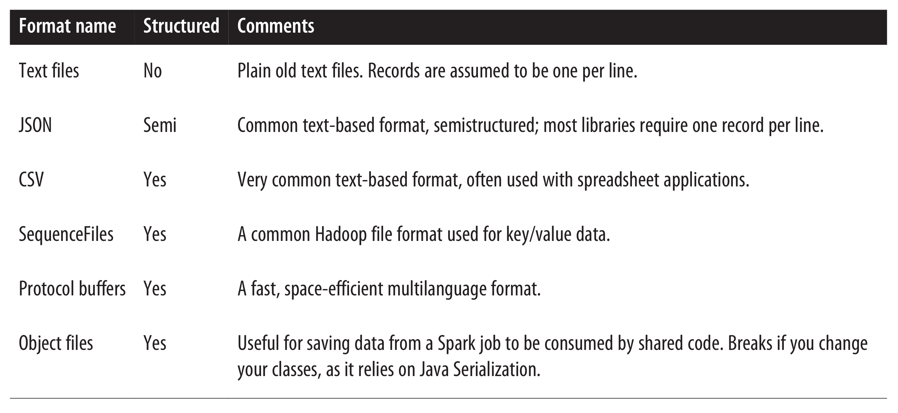

# File Operations
## File formats
Spark makes it very simple to load and save data in a large number of file
formats. Formats range from unstructured, like text, to semistructured, like
JSON, to structured, like SequenceFiles. The input formats that Spark wraps all
transparently handle compressed formats based on the file extension.



Text files are very simple to load from and save to with Spark. When we load 
a single text file as an RDD, each input line becomes an element in the RDD. We can also
load multiple whole text files at the same time into a pair RDD, with the key being the
name and the value being the contents of each file. Loading a single text file is as simple as calling the `textFile()` function on our SparkContext with the path to the file:

```Python
# Loading a text file
input = sc.textFile("file:///user/livy/two-cities.txt")

# Saving as a text file in Python
result.saveAsTextFile(outputFile)
```

JSON is a popular semistructured data format. The simplest way to load JSON data is
by loading the data as a text file and then mapping over the values with a JSON
parser.


```Python
# Loading unstructured JSON
import json
data = input.map(lambda x: json.loads(x))

# Saving JSON
(data.filter(lambda x: x['lovesPandas']).map(lambda x: json.dumps(x))
.saveAsTextFile(outputFile))
```

