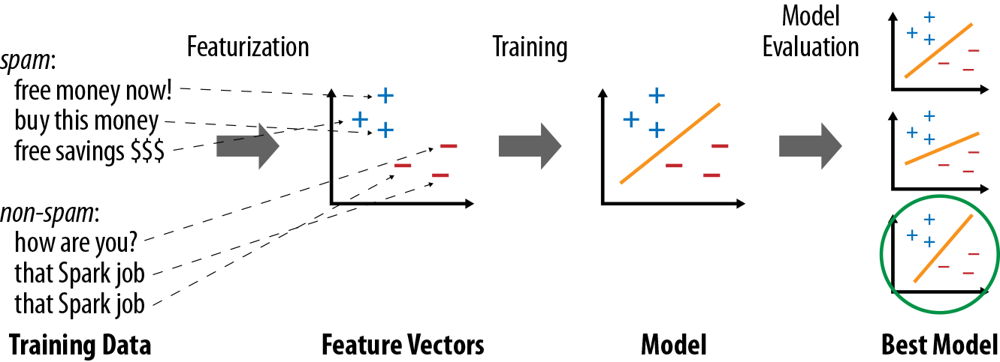
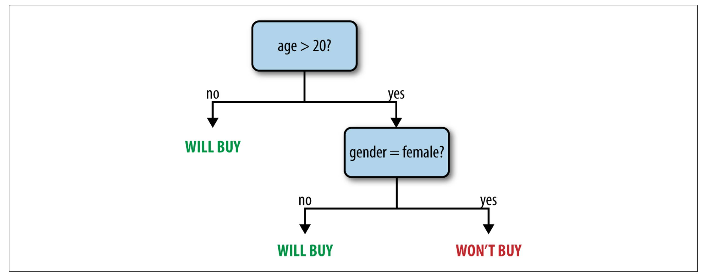

# Machine learning

MLlib is Spark’s library of machine learning functions. Designed to run in
parallel on clusters, MLlib contains a variety of learning algorithms and is
accessible from all of Spark’s programming languages.



> **warning** As of Spark 2.0, the RDD-based APIs in the spark.mllib package have entered maintenance mode. The primary Machine Learning API for Spark is now the DataFrame-based API in the spark.ml package.

## Data types

MLlib supports local vectors and matrices stored on a single machine, as well as distributed matrices backed by one or more RDDs. Local vectors and local matrices are simple data models that serve as public interfaces.

### Local vectors

A local vector has integer-typed and 0-based indices and double-typed values, stored on a single machine. MLlib supports two types of local vectors: dense and sparse. A dense vector is backed by a double array representing its entry values, while a sparse vector is backed by two parallel arrays: indices and values. For example, a vector (1.0, 0.0, 3.0) can be represented in dense format as [1.0, 0.0, 3.0] or in sparse format as (3, [0, 2], [1.0, 3.0]), where 3 is the size of the vector.

MLlib recognizes the following types as dense vectors:

* NumPy’s array
* Python’s list, e.g., [1, 2, 3]

and the following as sparse vectors:

* MLlib’s SparseVector.
* SciPy’s csc_matrix with a single column

> **Info** recommend using NumPy arrays over lists for efficiency, and using the factory methods implemented in Vectors to create sparse vectors.

```Python
import numpy as np
import scipy.sparse as sps
from pyspark.mllib.linalg import Vectors

# Use a NumPy array as a dense vector.
dv1 = np.array([1.0, 0.0, 3.0])
# Use a Python list as a dense vector.
dv2 = [1.0, 0.0, 3.0]
# Create a SparseVector.
sv1 = Vectors.sparse(3, [0, 2], [1.0, 3.0])
# Use a single-column SciPy csc_matrix as a sparse vector.
sv2 = sps.csc_matrix((np.array([1.0, 3.0]), np.array([0, 2]), np.array([0, 2])), shape = (3, 1))
```

### Labeled point
A labeled point is a local vector, either dense or sparse, associated with a label/response. In MLlib, labeled points are used in supervised learning algorithms. We use a double to store a label, so we can use labeled points in both regression and classification. For binary classification, a label should be either 0 (negative) or 1 (positive). For multiclass classification, labels should be class indices starting from zero: 0, 1, 2, ....

```Python
from pyspark.mllib.linalg import SparseVector
from pyspark.mllib.regression import LabeledPoint

# Create a labeled point with a positive label and a dense feature vector.
pos = LabeledPoint(1.0, [1.0, 0.0, 3.0])

# Create a labeled point with a negative label and a sparse feature vector.
neg = LabeledPoint(0.0, SparseVector(3, [0, 2], [1.0, 3.0]))
```

#### Sparse data

It is very common in practice to have sparse training data. MLlib supports reading training examples stored in LIBSVM format, which is the default format used by `LIBSVM` and `LIBLINEAR`. It is a text format in which each line represents a labeled sparse feature vector using the following format:

```
label index1:value1 index2:value2 ...
```
where the indices are one-based and in ascending order. After loading, the feature indices are converted to zero-based.

## Statistics
Basic statistics are an important part of data analysis, both in ad hoc exploration and
understanding data for machine learning. MLlib offers several widely used statistic
functions that work directly on RDDs, through methods in the `mllib.stat.Statistics` class. Some commonly used ones include:

### `Statistics.colStats(rdd)`
Computes a statistical summary of an RDD of vectors, which stores the min,
max, mean, and variance for each column in the set of vectors. This can be used
to obtain a wide variety of statistics in one pass.

### `Statistics.corr(rdd, method)`
Computes the correlation matrix between columns in an RDD of vectors, using
either the Pearson or Spearman correlation ( method must be one of pearson and
spearman ).

### `Statistics.corr(rdd1, rdd2, method)`
Computes the correlation between two RDDs of floating-point values, using
either the Pearson or Spearman correlation ( method must be one of pearson and
spearman ).

### `Statistics.chiSqTest(rdd)`
Computes Pearson’s independence test for every feature with the label on an
RDD of LabeledPoint objects. Returns an array of ChiSqTestResult objects that
capture the p-value, test statistic, and degrees of freedom for each feature.
Label and feature values must be categorical (i.e., discrete values).

Apart from these methods, RDDs containing numeric data offer several basic
statistics such as `mean()`, `stdev()`, and `sum()`. In addition, RDDs support
`sample()` and `sampleByKey()` to build simple and stratified samples of data.

> [Jupyter notebook for stats](statistics-exercise.ipynb)

> [Solution: Jupyter notebook for stats](statistics.ipynb)

## Feature Extraction
The mllib.feature package contains several classes for common feature transforma‐
tions. These include algorithms to construct feature vectors from text (or from other
tokens), and ways to normalize and scale features.
TF-IDF
Term Frequency–Inverse Document Frequency, or TF-IDF, is a simple way to gener‐
ate feature vectors from text documents (e.g., web pages). It computes two statistics
for each term in each document: the term frequency (TF), which is the number of
times the term occurs in that document, and the inverse document frequency (IDF),
which measures how (in)frequently a term occurs across the whole document corpus.
The product of these values, TF × IDF, shows how relevant a term is to a specific
document (i.e., if it is common in that document but rare in the whole corpus).
MLlib has two algorithms that compute TF-IDF: HashingTF and IDF , both in the
mllib.feature package. HashingTF computes a term frequency vector of a given size
from a document. In order to map terms to vector indices, it uses a technique known
as the hashing trick. Within a language like English, there are hundreds of thousands
of words, so tracking a distinct mapping from each word to an index in the vector
would be expensive. Instead, HashingTF takes the hash code of each word modulo a
desired vector size, S, and thus maps each word to a number between 0 and S–1. This
always yields an S-dimensional vector, and in practice is quite robust even if multiple
words map to the same hash code. The MLlib developers recommend setting S
between 2^18 and 2^20 .


HashingTF can run either on one document at a time or on a whole RDD. It requires
each “document” to be represented as an iterable sequence of objects—for instance, a
list in Python.

```Python
# Using HashingTF in Python
import numpy as np
import scipy.sparse as sps
from pyspark.mllib.linalg import Vectors
from pyspark.mllib.feature import HashingTF

sentence = "hello hello world"
words = sentence.split() # Split sentence into a list of terms
tf = HashingTF(10000) # Create vectors of size S = 10,000
tf.transform(words)
Vectors.sparse(10000, {3065: 1.0, 6861: 2.0})
rdd = sc.wholeTextFiles(data).map(lambda name, text: removePunctuation(text).split())
# Transforms an entire RDD
tfVectors = tf.transform(rdd)
```
Once you have built term frequency vectors, you can use IDF to compute the inverse
document frequencies, and multiply them with the term frequencies to compute the
TF-IDF. You first call fit() on an IDF object to obtain an IDFModel representing the
inverse document frequencies in the corpus, then call transform() on the model to
transform TF vectors into IDF vectors.

```Python
# Using TF-IDF in Python
from pyspark.mllib.feature import HashingTF, IDF
# Read a set of text files as TF vectors
rdd = sc.wholeTextFiles(data).map(lambda name, text: removePunctuation(text).split())
tf = HashingTF()
tfVectors = tf.transform(rdd).cache()
# Compute the IDF, then the TF-IDF vectors
idf = IDF()
idfModel = idf.fit(tfVectors)
tfIdfVectors = idfModel.transform(tfVectors)
```

## Classification and Regression
Classification and regression are two common forms of supervised learning, where
algorithms attempt to predict a variable from features of objects using labeled train‐
ing data (i.e., examples where we know the answer). The difference between them is
the type of variable predicted: in classification, the variable is discrete (i.e., it takes on
a finite set of values called classes); for example, classes might be spam or nonspam for
emails, or the language in which the text is written. In regression, the variable predic‐
ted is continuous (e.g., the height of a person given her age and weight).

### Linear regression
Linear regression is one of the most common methods for regression, predicting the
output variable as a linear combination of the features. MLlib also supports L^1 and L^2
regularized regression, commonly known as Lasso and ridge regression.
The linear regression algorithms are available through the `mllib.regression.Line
arRegressionWithSGD` , `LassoWithSGD` , and `RidgeRegressionWithSGD` classes. These
follow a common naming pattern throughout MLlib, where problems involving mul‐
tiple algorithms have a “With” part in the class name to specify the algorithm used.

Here, SGD is Stochastic Gradient Descent.

These classes all have several parameters to tune the algorithm:
> `numIterations`: Number of iterations to run (default: 100 ).

> `stepSize`: Step size for gradient descent (default: 1.0 ).

> `intercept`: Whether to add an intercept or bias feature to the data—that is, another feature whose value is always 1 (default: false ).

> `regParam` Regularization parameter for Lasso and ridge (default: 1.0 ).
In Python, you use the class method `LinearRegressionWithSGD.train()`, to which you pass key/value parameters.

```Python
Linear regression in Python
from pyspark.mllib.regression import LabeledPoint
from pyspark.mllib.regression import LinearRegressionWithSGD
points = # (create RDD of LabeledPoint)
model = LinearRegressionWithSGD.train(points, iterations=200, intercept=True)
print ("weights: %s, intercept: %s" % (model.weights, model.intercept))
```

### Logistic regression
Logistic regression is a binary classification method that identifies a linear separating
plane between positive and negative examples. In MLlib, it takes LabeledPoint s with
label 0 or 1 and returns a LogisticRegressionModel that can predict new points.

The LogisticRegressionModel from these algorithms computes a score between 0
and 1 for each point, as returned by the logistic function. It then returns either 0 or 1
based on a threshold that can be set by the user: by default, if the score is at least 0.5, it
will return 1 . You can change this threshold via `setThreshold()`. You can also disable it altogether via `clearThreshold()`, in which case `predict()` will return the raw
scores. For balanced datasets with about the same number of positive and negative
examples, we recommend leaving the threshold at 0.5. For imbalanced datasets, you
can increase the threshold to drive down the number of false positives (i.e., increase
precision but decrease recall), or you can decrease the threshold to drive down the
number of false negatives.

> [Jupyter notebook for regression](regression-exercise.ipynb)

<!--
> [Jupyter notebook for regression](regression-exercise.ipynb)
-->

### Spam classification

As a quick example of MLlib, we show a very simple program for building a spam
classifier. This program uses two MLlib algorithms: `HashingTF` , which builds
term frequency feature vectors from text data, and
`Logistic RegressionWithLBFGS`, which implements the logistic regression
procedure using Limited-memory Broyden–Fletcher–Goldfarb–Shanno (BFGS)
algorithm. We assume that we start with two files, [spam.txt](spam.txt) and [normal.txt](normal.txt), each of which contains examples of spam and non-spam
emails, one per line. We then turn the text in each file into a feature vector
with TF, and train a logistic regression model to separate the two types of
messages.

```Python
# Load ML libraries
from pyspark.mllib.regression import LabeledPoint
from pyspark.mllib.feature import HashingTF
from pyspark.mllib.classification import LogisticRegressionWithLBFGS

# Create RDDs of Spam and Normal text
spam = sc.textFile("spam.txt")
normal = sc.textFile("normal.txt")

# Create a HashingTF instance to map email text to vectors of 10,000 features.
tf = HashingTF(numFeatures = 10000)

# Each email is split into words, and each word is mapped to one feature.
spamFeatures = spam.map(lambda email: tf.transform(email.split(" ")))
normalFeatures = normal.map(lambda email: tf.transform(email.split(" ")))

# Create LabeledPoint datasets for positive (spam) and negative (normal) examples.
positiveExamples = spamFeatures.map(lambda features: LabeledPoint(1, features))
negativeExamples = normalFeatures.map(lambda features: LabeledPoint(0, features))
trainingData = positiveExamples.union(negativeExamples)
trainingData.cache() # Cache since Logistic Regression is an iterative algorithm.

# Run Logistic Regression using the LBFGS algorithm.
model = LogisticRegressionWithLBFGS.train(trainingData)

# Test on a positive example (spam) and a negative one (normal). We first apply
# the same HashingTF feature transformation to get vectors, then apply the model.
posTest = tf.transform("I recently inherited wealth, send me money ...".split(" "))
negTest = tf.transform("Unfortunately, I won't be at the office ...".split(" "))
print ("Prediction for positive test example: %g" % model.predict(posTest))
print ("Prediction for negative test example: %g" % model.predict(negTest))
```
> [Jupyter notebook for spam](spam.ipynb)

> [Jupyter notebook for NY taxi data](ny-taxi.ipynb)

### Decision trees and random forests
Decision trees are a flexible model that can be used for both classification and regres‐
sion. They represent a tree of nodes, each of which makes a binary decision based on
a feature of the data (e.g., is a person’s age greater than 20?), and where the leaf nodes
in the tree contain a prediction (e.g., is the person likely to buy a product?). Decision
trees are attractive because the models are easy to inspect and because they support
both categorical and continuous features.



In MLlib, you can train trees using the `mllib.tree.DecisionTree` class, through the
static methods trainClassifier() and trainRegressor() . Unlike in some of the
other algorithms, the Java and Scala APIs also use static methods instead of a Deci
sionTree object with setters. The training methods take the following parameters:

> `data`: RDD of LabeledPoint .

> `numClasses`: (classification only) Number of classes to use.

> `impurity`: Node impurity measure; can be gini or entropy for classification, and must be
variance for regression.

> `maxDepth`: Maximum depth of tree (default: 5 ).

> `maxBins`: Number of bins to split data into when building each node (suggested value: 32 ).

> `categoricalFeaturesInfo`: A map specifying which features are categorical, and how many categories they each have. For example, if feature 1 is a binary feature with labels 0 and 1, and feature 2 is a three-valued feature with values 0, 1, and 2, you would pass {1: 2,
2: 3} . Use an empty map if no features are categorical.

The online [MLlib documentation](https://spark.apache.org/docs/latest/mllib-decision-tree.html) contains a detailed explanation of the algorithm
used. The cost of the algorithm scales linearly with the number of training examples,
number of features, and maxBins . For large datasets, you may wish to lower maxBins
to train a model faster, though this will also decrease quality.

The `train()` methods return a `DecisionTreeModel` . You can use it to predict values
for a new feature vector or an RDD of vectors via predict() , or print the tree using
`toDebugString()`. This object is serializable, so you can save it using Java Serializa‐
tion and load it in another program.

RandomForest is available through `RandomForest.trainClassifier` and `trainRegressor`.
Apart from the pertree parameters just listed, RandomForest takes the following parameters:

> `numTrees`: How many trees to build. Increasing numTrees decreases the likelihood of over‐
fitting on training data.

> `featureSubsetStrategy`: Number of features to consider for splits at each node; can be auto (let the library select it), all , sqrt , log2 , or onethird ; larger values are more expensive.

> `seed`: Random-number seed to use.

Random forests return a `WeightedEnsembleModel` that contains several trees (in the
`weakHypotheses` field, weighted by `weakHypothesisWeights` ) and can `predict()` an
RDD or Vector . It also includes a toDebugString to print all the trees.

> [Jupyter notebook for decision tree](trees-exercise.ipynb)

<!--
> [Jupyter notebook for decision tree](trees.ipynb)
-->
