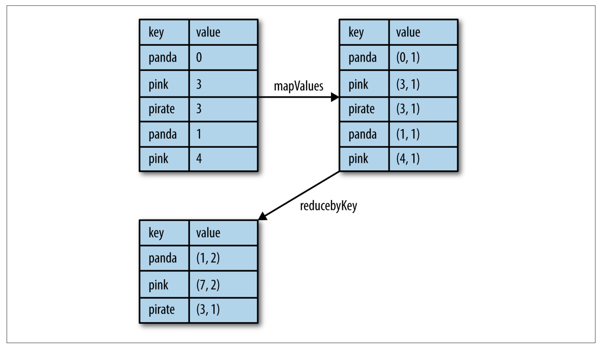

# Key/value RDDs
Key/value RDDs are commonly used to perform aggregations, and often we will do
some initial ETL (extract, transform, and load) to get our data into a key/value
format. Key/value RDDs expose new operations (e.g., counting up reviews for each
product, grouping together data with the same key, and grouping together two
different RDDs).

Spark provides special operations on RDDs containing key/value pairs. These RDDs
are called `pair RDDs`. Pair RDDs are a useful building block in many programs, as
they expose operations that allow you to act on each key in parallel or regroup
data across the network. For example, pair RDDs have a `reduceByKey()` method that
can aggregate data separately for each key, and a `join()` method that can merge
two RDDs together by grouping elements with the same key. It is common to extract
fields from an RDD (representing, for instance, an event time, customer ID, or
other identifier) and use those fields as keys in pair RDD operations.

Running `map()` changes a regular RDD into a pair RDD:

```Python
# Create a pair of first word in a string and the string.
lines = sc.parallelize(["Hello World", "KBTU Cambridge"])
pairs = lines.map(lambda x: (x.split(" ")[0], x))
pairs.collect()
```
> output

> `[('Hello', 'Hello World'), ('KBTU', 'KBTU Cambridge')]`


### Transformations on one pair RDD
> PairRDD: {(1, 2), (3, 4), (3, 6)}

| Function name | Purpose | Example | Result |
| -- | -- | -- | -- |
|  `reduceByKey(func)` | Combine values with the same key. | `rdd.reduceByKey((x, y) => x + y)` | `{(1,2), (3,10)}` |
|  `groupByKey()` | Group values with the same key.| `rdd.groupByKey()` | `{(1, [2]), (3, [4, 6])}` |
|  `mapValues(func)` | Apply a function to each value of a pair RDD without changing the key. | `rdd.mapValues(x => x+1)` | `{(1, 3), (3, 5), (3, 7)}` |
|  `flatMapValues(func)` | Apply a function to each value of a pair RDD without changing the key. | `rdd.flatMapValues(x => (x to 5))` | `{(1, 2), (1, 3), (1, 4), (1, 5), (3, 4), (3, 5)}` |
|  `keys()` | Return an RDD of just the keys. | `rdd.keys()` | `{1, 3, 3}` |
|  `values()` | Return an RDD of just the values. | `rdd.values()` | `{2, 4, 6}` |
|  `sortByKey()` | Return an RDD sorted by the key. | `rdd.sortByKey()` | `{(1, 2), (3, 4), (3, 6)}` |


### Transformation of two-pair RDDs
> rdd = {(1, 2), (3, 4), (3, 6)} other = {(3, 9)}


> [Download Jupyter notebook of pair RDD transformations](key-value.ipynb)

Pair RDDs are also still RDDs (of tuples), and thus support the same functions
as RDDs. For instance, we can take our pair RDD from the previous section and
filter out lines longer than 20 characters.

```Python
pairs = sc.parallelize([("gru", "likes coffee"), ("minons", "like long strings and coffee")])
result = pairs.filter(lambda keyValue: len(keyValue[1]) < 20)
```

> `[('gru', 'likes coffee')]`

## Aggregations

When datasets are described in terms of key/value pairs, it is common to want to
aggregate statistics across all elements with the same key. We have looked at the
`fold()` , `combine()` , and `reduce()` actions on basic RDDs, and similar
per-key transformations exist on pair RDDs. Spark has a similar set of
operations that combines values that have the same key.

* `reduceByKey()` takes a function and use it to combine values.
`reduceByKey()` runs several parallel reduce operations, one
for each key in the dataset, where each operation combines values that have the
same key. `reduceByKey()` does not return a value to the user program, instead,
it returns a new RDD consisting of each key and the reduced value for that key.

> Per-key average with reduceByKey() and mapValues() in Python


```Python
rdd = sc.parallelize([("panda", 0), ("pink", 3), ("pirate", 3), ("panda", 1), ("pink", 4)])
rdd.mapValues(lambda x: (x, 1)).reduceByKey(lambda x, y: (x[0] + y[0], x[1] + y[1])).collect()
```
> `[('panda', (1, 2)), ('pink', (7, 2)), ('pirate', (3, 1))]`

* `foldByKey()` use a zero value of the same type of the data in our RDD and
combination function.

* `combineByKey()` is the most general of the per-key aggregation functions.
`combineByKey()` allows the user to return values that are not the same type as our input data. As `combineByKey()` goes through the elements in a partition, each element
either has a key it hasn’t seen before or has the same key as a previous element.
If it’s a new element, `combineByKey()` uses a function called `createCombiner()`,
to create the initial value for the accumulator on that key. It’s important to
note that this happens the first time a key is found in each partition, rather than
only the first time the key is found in the RDD. If it is a value we have seen
before while processing that partition, it will instead use the provided function, `mergeValue()`, with the current value for the accumulator for that key and the
new value. Since each partition is processed independently, we can have multiple
accumulators for the same key. When we are merging the results from each
partition, if two or more partitions have an accumulator for the same key we
merge the accumulators using the user-supplied `mergeCombiners()` function.

```Python
# Per-key average using combineByKey()
count = nums.combineByKey((lambda x: (x,1)),
                          (lambda x, y: (x[0] + y, x[1] + 1)),
                          (lambda x, y: (x[0] + y[0], x[1] + y[1])))
count.map(lambda key, xy: (key, xy[0]/xy[1])).collectAsMap()
```

> combineByKey workflow


## Data partitioning

Spark’s partitioning is available on all RDDs of key/value pairs. Although Spark
does not give explicit control of assigning specific worker nodes for each key,
it lets the program ensure that a set of keys will appear together on some node.
For example, you might choose to hash-partition an RDD into 100 partitions so
that keys that have the same hash value modulo 100 appear on the same node.
Or you might range-partition the RDD into sorted ranges of keys so that
elements with keys in the same range appear on the same node.

In Python, the number of partitions can be specified using `partitionBy()`.

```Python
rdd.partitionBy(npartitions, function)
```
### Challenge: Computing Pi with partitions

* Compute the value of Pi with range partitioning (hint: use a large `n` like
  10 million).
* Vary the parition numbers and see the effect.

```Python
count = sc.parallelize(range(1, n + 1), npartitions).map(f).reduce(add)
```

> [Download Jupyter notebook for computing Pi with partitions](pi-partition.ipynb)
