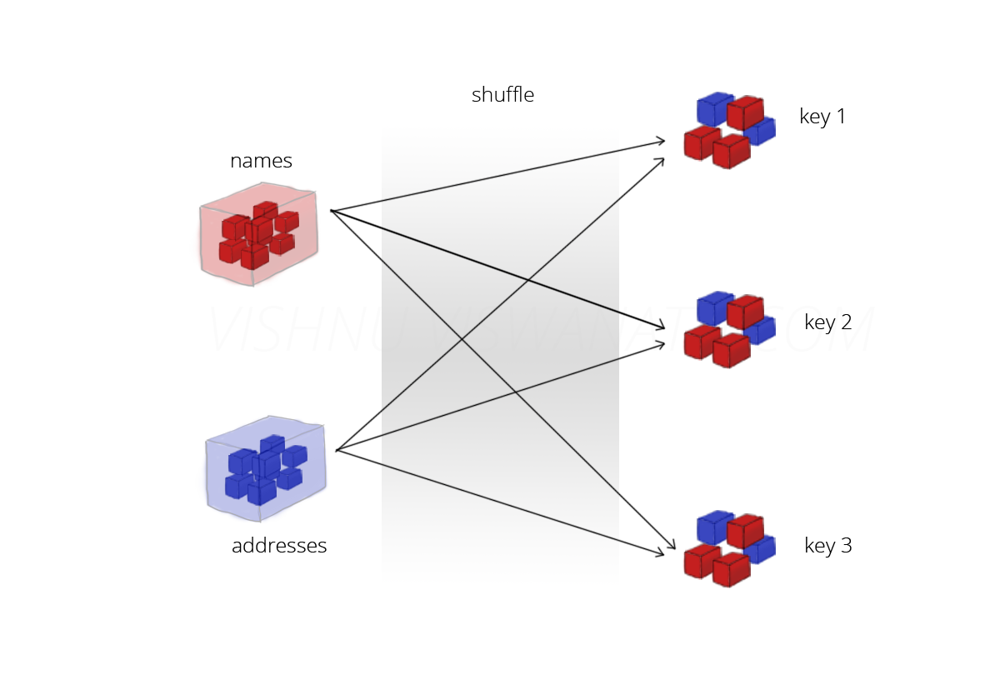
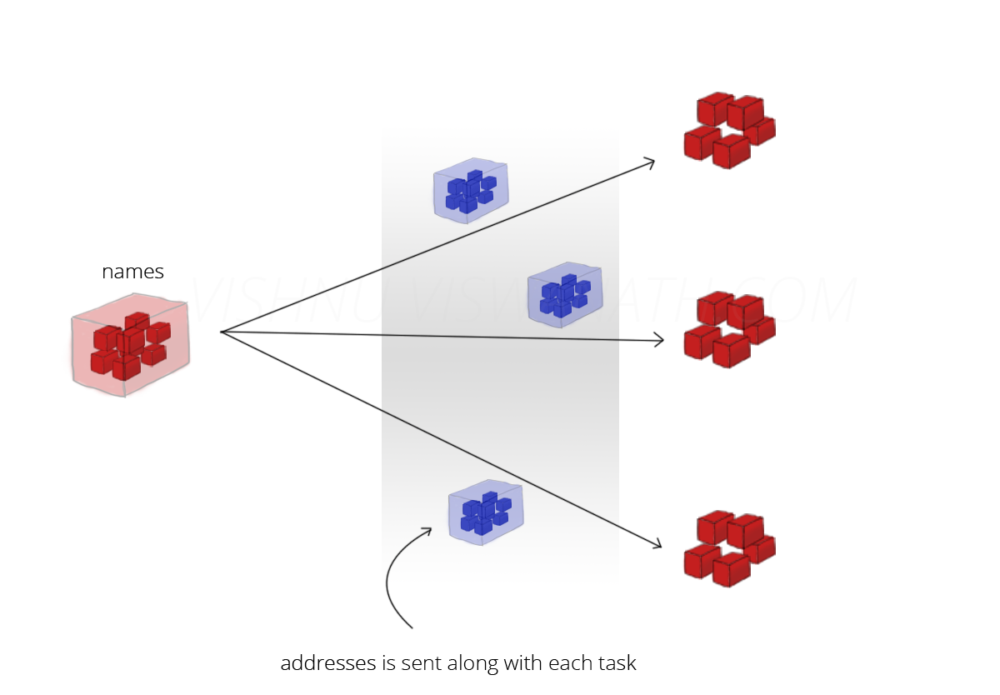
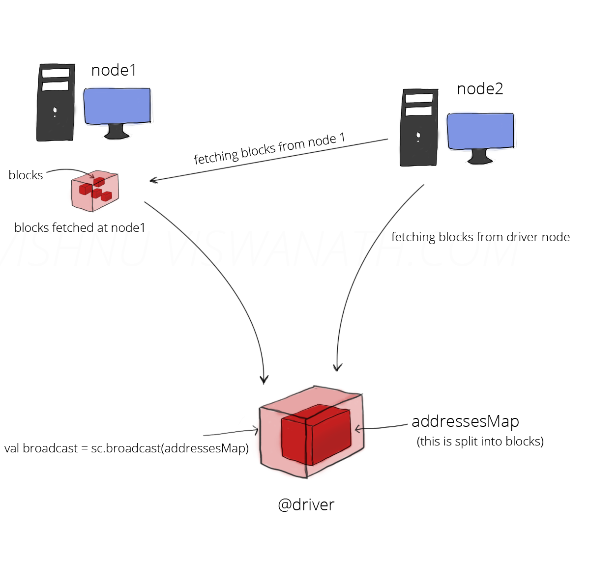

# Accumulators and Broadcasts

When we normally pass functions to Spark, such as a `map()` function or a
condition for `filter()`, they can use variables defined outside them in the
driver program, but each task running on the cluster gets a new copy of each
variable, and updates from these copies are not propagated back to the driver.
Spark’s shared variables, `accumulators` and `broadcast` variables, relax this
restriction for two common types of communication patterns: aggregation of
results and broadcasts.

## Accumulators
Accumulators, as the name suggests accumulates data during execution. An
accumulator is initialized at the driver and is then modified (added) by each
executors. Finally all these values are aggregated back at the driver.

For example, say that we are loading a log file, but we are also interested in
how many lines of the log file were blank.

```Python
 # Accumulator empty line count
file = sc.textFile(inputFile)
# Create Accumulator[Int] initialized to 0
blankLines = sc.accumulator(0)
def extractLines(line):
  global blankLines # Make the global variable accessible
  if (line == ""):
    blankLines += 1
  return line.split(" ")

logfile = file.flatMap(extractLines)
```

## Broadcasts

Broadcast variables, allows the program to efficiently send a large, read-only
value to all the worker nodes for use in one or more Spark operations. They come
in handy, for example, if your application needs to send a large, read-only
lookup table to all the nodes, or even a large feature vector in a machine
learning algorithm. Consider two RDDs `names` and `addresses` which are to be
joined.



Here, both names and addresses will be shuffled over the network for performing
the join which is not efficient since any data transfer over the network will
reduce the execution speed.



This is also inefficient since we are sending sizable amount of data over the
network for each task. So how do we overcome this problem? By means of broadcast
variables. If a variable is broadcasted, it will be sent to each node only once, t
hereby reducing network traffic.

Broadcast variables are read-only, broadcast value is an immutable object. Spark
uses BitTorrent like protocol for sending the broadcast variable across the
cluster, i.e., for each variable that has to be broadcasted, initially the
driver will act as the only source. The data will be split into blocks at the
driver and each leecher (receiver) will start fetching the block to it’s local
directory. Once a block is completely received, then that leecher will also act
as a source for this block for the rest of the leechers (This reduces the load
at the machine running driver). This is continued for rest of the blocks. So
initially, only the driver is the source and later on the number of sources
increases - because of this, rate at which the blocks are fetched by a node
increases over time.



Recall that Spark automatically sends all variables referenced in your closures
to the worker nodes. While this is convenient, it can also be inefficient. As an
example, say that we wanted to write a Spark program that looks up countries by
their IP address in an array.

```Python
# IP lookup
# Look up the locations of the IP on the
# RDD contactCounts. We load a list of IP to country code to support this lookup.
ipPrefixes = loadIPTable()
def processIPCount(ip_count, ipPrefixes):
  country = lookupCountry(ip_count[0], ipPrefixes)
  count = ip_count[1]
  return (country, count)
countryContactCounts = (contactCounts
                        .map(processipCount)
                        .reduceByKey((lambda x, y: x+ y)))
```

The `ipPrefixes` could easily be several megabytes in size, making it expensive
to send that Array from the master alongside each task. In addition, if we used
the same `ipPrefixes` object later, it would be sent again to each node. This
can be fixed by making `ipPrefixes` a broadcast variable:

```Python3
ipPrefixes = sc.broadcast(loadCallipTable())
def processipCount(ip_count, ipPrefixes):
  country = lookupCountry(ip_count[0], ipPrefixes.value)
  count = ip_count[1]
  return (country, count)
countryContactCounts = (contactCounts
                       .map(processipCount)
                       .reduceByKey((lambda x, y: x+ y)))
countryContactCounts.saveAsTextFile(outputDir + "/countries.txt")
```
