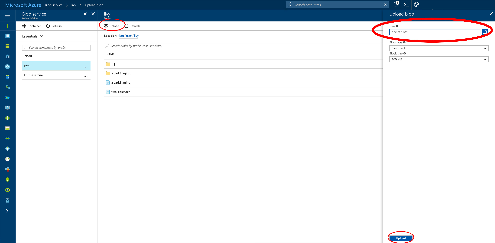
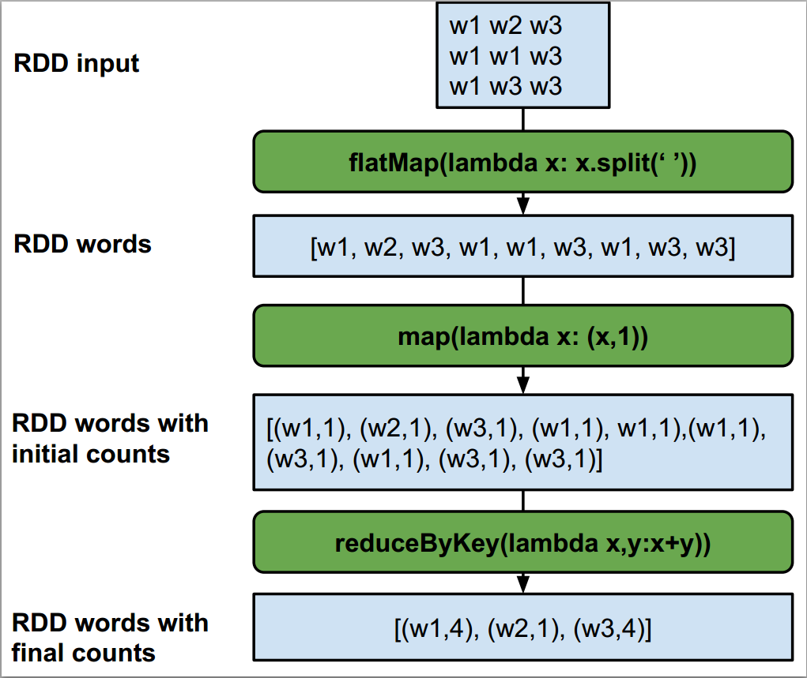

# Exercise: Word count

Let's count the frequency of words that appear in Charles Dicken's `A tale of
two cities`. Do not include special characters when counting the word frequency.

* Upload the [`A tale of two cities`](two-cities.txt) file to `/user/livy` in
the storage container attached to the Spark cluster.



* This allows you to read the text file from the root directory directly as
`sc.textFile("two-cities.txt")`.

* Start by creating a new RDD by splitting the words.

* Then create an RDD of pairs `(word, 1)` for each occurrence of a word using
a `map()`

* Finally, use the `reduceByKey()` function, which merges the values for each
key using an associative reduce function.

* The following function removes any special characters:

```Python
# Define a function to remove any special characters
def removePunctuation(text):
    """Removes punctuation, changes to lower case, and strips leading and trailing spaces.
    Note:
        Only spaces, letters, and numbers should be retained.  Other characters should should be
        eliminated (e.g. it's becomes its).  Leading and trailing spaces should be removed after
        punctuation is removed.
    Args:
        text (str): A string.
    Returns:
        str: The cleaned up string.
    """
    return re.sub(r'[^a-z0-9\s]','',text.lower().strip())
```

## Challenge
* Print only those words thar are mentioned more than 10 times.

## Solution


* First, the `flatMap()` function takes the input file that is returned by the
SparkContext function that returns the lines of the file. This `flatMap` does
two things it applies the lambda function to each line, creating a list of
space separated words. Then the second thing flatMap does by default is
flattening the list of lists, meaning that `[[w1,w2],[w2,w3]]` becomes
`[w1,w2,w2,w3]`.

* Second, a `map()` function is applied to the resulting RDD that is produced by
`flatMap`. The map operation applies the lambda function provided to each
element in the RDD. Here each element is a word in the list of words RDD and
the map produces a pair for each word composed of the word as the key and the
initial count as of that word as 1.

* Finally, the aggregation is performed with the `reduceByKey` function on the
resulting RDD. This is similar to the regular reduce operation that takes two
elements and applies a function to those two elements, but in this case the
words are first grouped by key, which in the case of (w1,1) is the word part
of the pair. This gives the following:
`[(w1,1),(w1,1),(w2,1)] ==> [(w1,2),(w2,1)]`.

* Following that we collect the output and print it as words with their counts.

### Solution for Challenge

How about getting the words that are mentioned more than 10 times? You could
try to modify the above code using the filter transformation to get only the
words that have 10 of more mentions in our output file. To do that we need to
chain `.filter(lambda x: x[1]>=10)` after the `reduceByKey` function:

<!--
> [Solution: WordCount Jupyter notebook](word-count.ipynb)
-->
