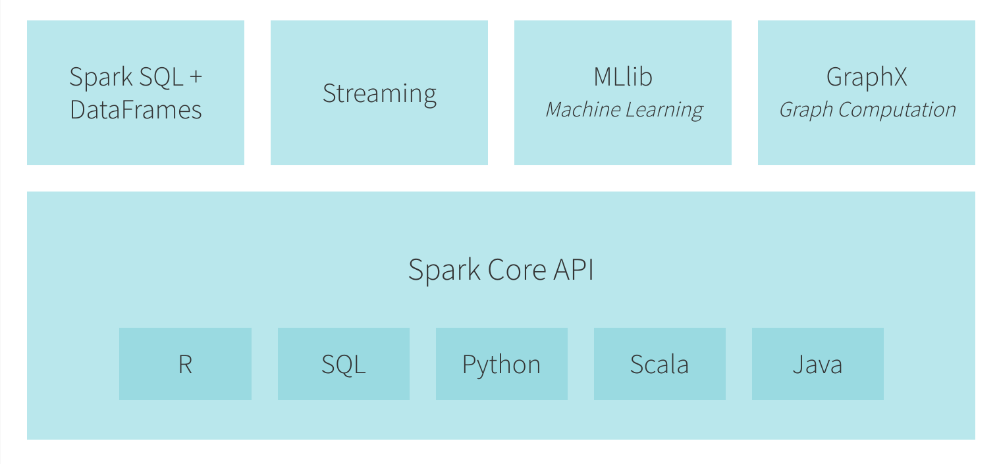

# Apache Spark

[Apache Spark](https://spark.apache.org/) is an open-source parallel processing
framework that supports in-memory processing to boost the performance of
big-data analytic applications. It was originally developed at UC Berkeley in
2009.

Spark is designed for data science and its abstraction makes data science easier.
Spark’s ability to cache the dataset in memory greatly speeds up iterative data
processing, making Spark an ideal processing engine for implementing algorithms
that can interpret and learn from the data.

Spark has several advantages compared to other big data and `MapReduce`
technologies like Hadoop and Storm. Spark provides an unified framework to
manage big data processing that supports diverse data sets (text data, graph
data, structured and unstructured data) as well as the ability to process data
in real-time or in batch. Spark enables applications in Hadoop clusters to run
up to 100x faster in memory and 10x faster even when running on disk. In
addition to Map and Reduce operations, Spark supports SQL queries,
streaming data, machine learning and graph data processing. Developers can also
use it to support other data processing tasks, benefiting from Spark’s extensive
set of developer libraries and APIs, and its comprehensive support for languages
such as Java, Python, R and Scala. Spark is often used alongside Hadoop’s data
storage module, HDFS, but can also integrate equally well with other popular
data storage subsystems such as HBase, Cassandra, MapR-DB, MongoDB and Amazon’s
S3.

Spark holds intermediate results in memory rather than writing them to disk
which is very useful especially when you need to work on the same dataset
multiple times. It’s designed to be an execution engine that works both
in-memory and on-disk. Spark operators perform external operations when data
does not fit in memory. Spark can be used for processing datasets that larger
than the aggregate memory in a cluster. Spark will attempt to store as much data
in memory as possible and then will spill to disk. It can store part of a data
set in memory and the remaining data on the disk. With this in-memory data
storage, Spark comes with performance advantage.

Spark is written in Scala Programming Language and runs on Java Virtual Machine
(JVM) environment.

## Spark use case?
Spark is a general-purpose data processing engine, an API-powered tool-kit
which data scientists and application developers incorporate into their
applications to rapidly query, analyse and transform data at scale. Spark’s
flexibility makes it well-suited to tackling a range of use cases, and it is
capable of handling several petabytes of data at a time, distributed across a
cluster of thousands of cooperating physical or virtual servers. Some use cases
are:
* Stream processing
* Machine learning
* Interactive analysis (financial trading)
* Data integration and pipelines

## Hadoop v Spark

`Spark is not, despite the hype, a replacement for Hadoop. Nor is MapReduce
dead.`

The MapReduce algorithm involves: `Map`, which takes a set of data and converts
it into another set of data, by breaking down individual elements into tuples (
key/value pairs), and a `reduce` task, which takes the output from a map as an
input and combines those data tuples into a smaller set of tuples. As the
sequence of the name MapReduce implies, the reduce task is always performed
after the map job. The major advantage of MapReduce is that it is easy to scale
data processing over multiple computing nodes.

`MapReduce` is effective for single-pass computations (a single-map and a
single-reduce), but not very efficient for cases that require multi-pass
computations and algorithms. MapReduce requires output data be stored in a
distributed file system at each step. Hence, this approach tends to reduce the
computation speed due to replication and disk storage.

Hadoop as a big data processing technology has been around since 2011 and has
proven to be the solution of choice for processing large data sets. Hadoop is
an open-source framework that is designed to scale up from single servers to
thousands of machines, each offering local computation and storage.

Spark allows programmers to develop complex, multi-step data pipelines using
directed acyclic graph (DAG) pattern. It also supports in-memory data sharing
across DAGs, so that different jobs can work with the same data. Spark runs on
top of existing Hadoop Distributed File System (HDFS) infrastructure to provide
enhanced and additional functionality.

Hadoop gives Spark many of the capabilities that broad adoption and
use in production environments:

* YARN resource manager, which is responsibile for scheduling tasks
across available nodes in the cluster.
* Distributed File System, which stores data when the cluster runs out of
free memory, and which persistently stores historical data when Spark is
not running.
* Disaster Recovery capabilities: which enable recovery of data when individual
nodes fail.
* Data Security.
* A distributed data platform

## Spark Ecosystem
Apache Spark consists of Spark Core and a set of libraries. The core is the
distributed execution engine and the Java, Scala, and Python APIs offer a
platform for distributed Extract Transform Load (ETL) application development.
Apache Spark has built-in modules for streaming, SQL, machine learning and
graph processing.

> Apache Spark components

### Spark Core
Spark Core is the underlying general execution engine that contains the basic
functionality of Spark, including components for task scheduling, memory
management, fault recovery, interacting with storage systems, and more. It
provides In-Memory computing and referencing datasets in external storage
systems. Spark Core also defines the API for the resilient distributed data-sets
(`RDD`s), which represent a collection of items distributed across many compute
nodes which can be manipulated in parallel.

### Spark SQL
Spark SQL provides a new data abstraction called `SchemaRDD` for working with
structured and semi-structured data. It allows querying data via `SQL` as well
as the `Apache Hive` variant of SQL—called the Hive Query Language (`HQL`)—and
it supports many sources of data, including Hive tables, Parquet, and JSON.

### Spark Streaming
This component leverages Spark Core's fast scheduling capability to enable
processing of live streams of data. It ingests data in mini-batches and
performs RDD transformations on those mini-batches of data.

### Spark MLlib
Spark also includes MLlib, a library that provides a growing set of machine
algorithms for common data science techniques: Classification, Regression,
Collaborative Filtering, Clustering and Dimensionality Reduction.

Spark’s ML Pipeline API is a high level abstraction to model an entire data
science workflow.   The ML pipeline package in Spark models a typical machine
learning workflow and provides abstractions like Transformer, Estimator,
Pipeline & Parameters.  This is an abstraction layer that makes data scientists
more productive.

### GraphX
GraphX is a library for manipulating graphs (e.g., a social network graphs,
city-scale road networks) and performing graph-parallel computations. GraphX
extends the Spark RDD API to create a directed graph with arbitrary properties
attached to each vertex and edge. GraphX also provides various operators for
manipulating graphs (e.g., `subgraph` and `mapVertices`) and a library of
common graph algorithms (e.g., PageRank and triangle counting).

## Spark Architecture

Spark Architecture includes following three main components:

* Data Storage: Spark uses HDFS file system for data storage purposes. It works
with any Hadoop compatible data source including HDFS, HBase, Cassandra, etc.

* API: provides the developers a standard interface in Scala, Java, and Python
programming languages.

* Resource management: Spark can be deployed as a Stand-alone server or it can
be on a distributed computing framework like Mesos or YARN.

# Spark Cluster Mode

Spark applications run as independent sets of processes on a cluster,
coordinated by the `SparkContext` object in your main program (called the
`driver` program).

Specifically, to run on a cluster, the `SparkContext` can connect to several
types of cluster managers (either Spark’s own standalone cluster manager,
Mesos or YARN), which allocate resources across applications. Once connected,
Spark acquires executors on nodes in the cluster, which are processes that run
computations and store data for your application. Next, it sends your
application code (defined by `JAR` or `Python` files passed to `SparkContext`)
to the executors. Finally, SparkContext sends tasks to the executors to run.

> Spark cluster overview

## Spark cluster components

* Each application gets its own executor processes, which stay up for the
duration of the whole application and run tasks in multiple threads. This has
the benefit of isolating applications from each other, on both the scheduling
side (each driver schedules its own tasks) and executor side (tasks from
different applications run in different JVMs). However, it also means that
data cannot be shared across different Spark applications (instances of
  SparkContext) without writing it to an external storage system.

* Spark is agnostic to the underlying cluster manager. As long as it can acquire
executor processes, and these communicate with each other, it is relatively easy
to run it even on a cluster manager that also supports other applications
(e.g. Mesos/YARN).

* The driver program must listen for and accept incoming connections from its
executors throughout its lifetime. As such, the driver program must be
network addressable from the worker nodes.

* Because the driver schedules tasks on the cluster, it should be run close
to the worker nodes, preferably on the same local area network. If you’d like
to send requests to the cluster remotely, it’s better to open an RPC to the
driver and have it submit operations from nearby than to run a driver far away
from the worker nodes.
